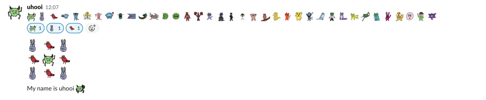
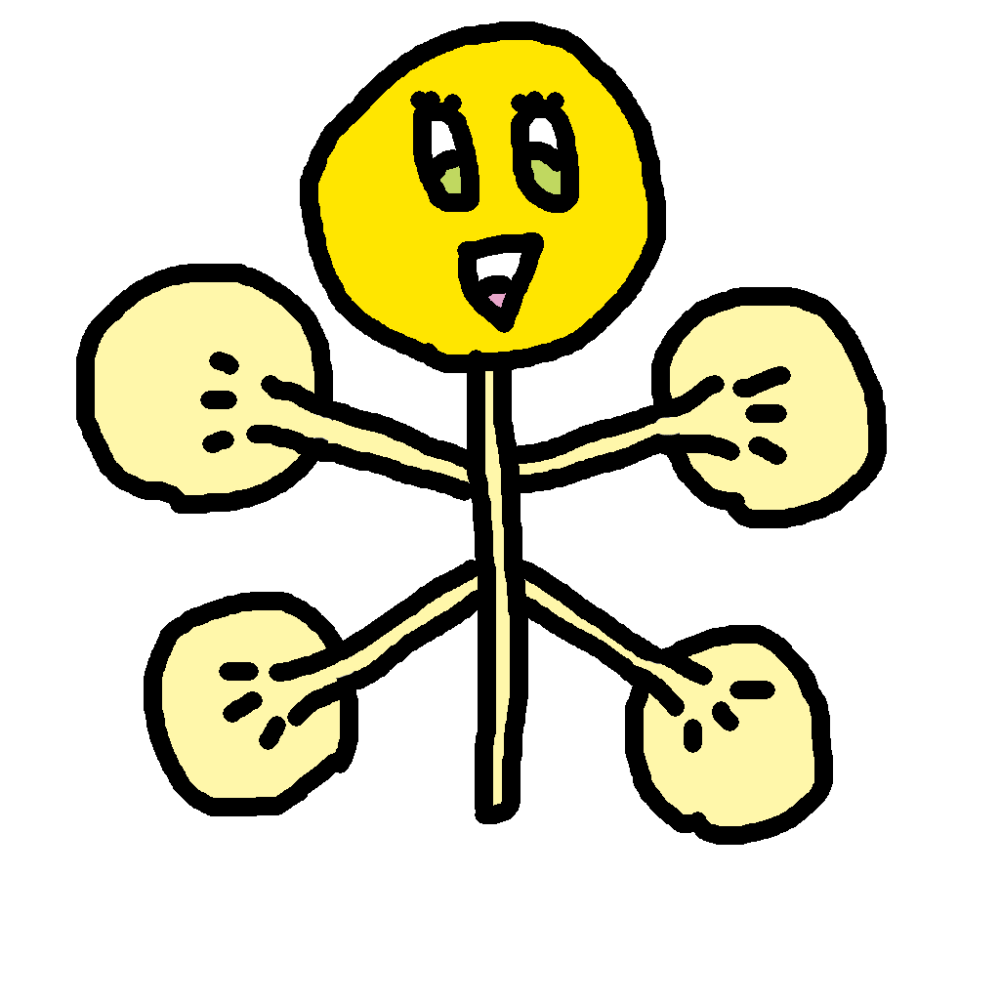
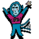
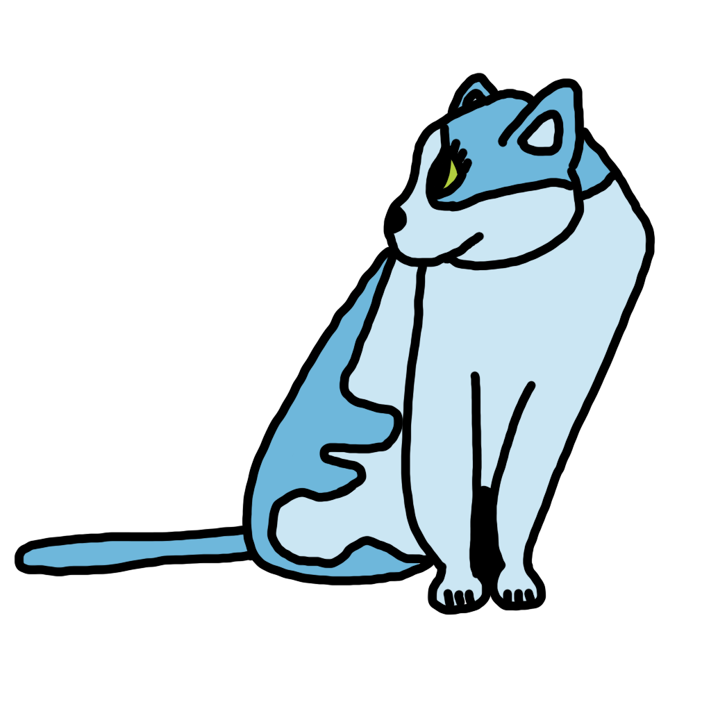

# UhooiPicBook-Icons

Uhooi's characters.

## How to use

Add it as custom emojis to Slack, you'll be happy 

## Characters

|Name|Icon|Dancing|
|:--|:--|:--|
|uhooi|||
|ayausa|||
|chibird|||
|conycat|||
|kyuso|||
|moepin|||
|entakun|||
|burakan|||
|samender|||
|madora|||
|mijara|||
|toge-n|||
|toge-n-close|||
|firesoul|||
|mabomagi|||
|chuni|||
|noalf|||
|renman|||
|reijin|||
|motokuma|||
|fktn|||
|rokukage|||
|marineko|||
|meikui|||
|totokuma|||
|bannzaru|||
|tamako|||
|monkuma|||
|nopetsune|||
|asainu|||
|tetsureon|||
|mikkaneko|||
|meriusa|||
|marisu|||
|monyolanpaselan|||
|burunga|||
|konaman|||
|miyakuma|||

## License

© 2022 THE Uhooi
